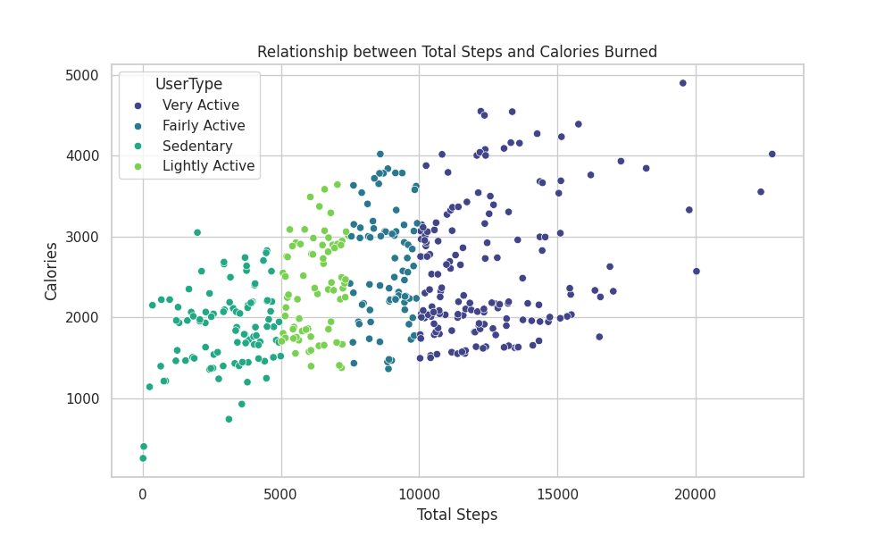
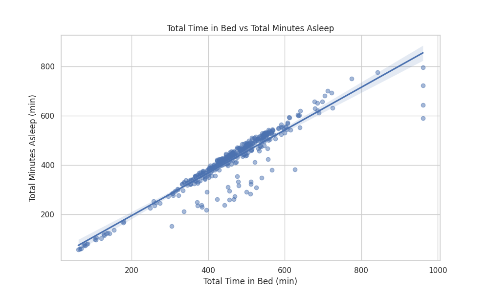
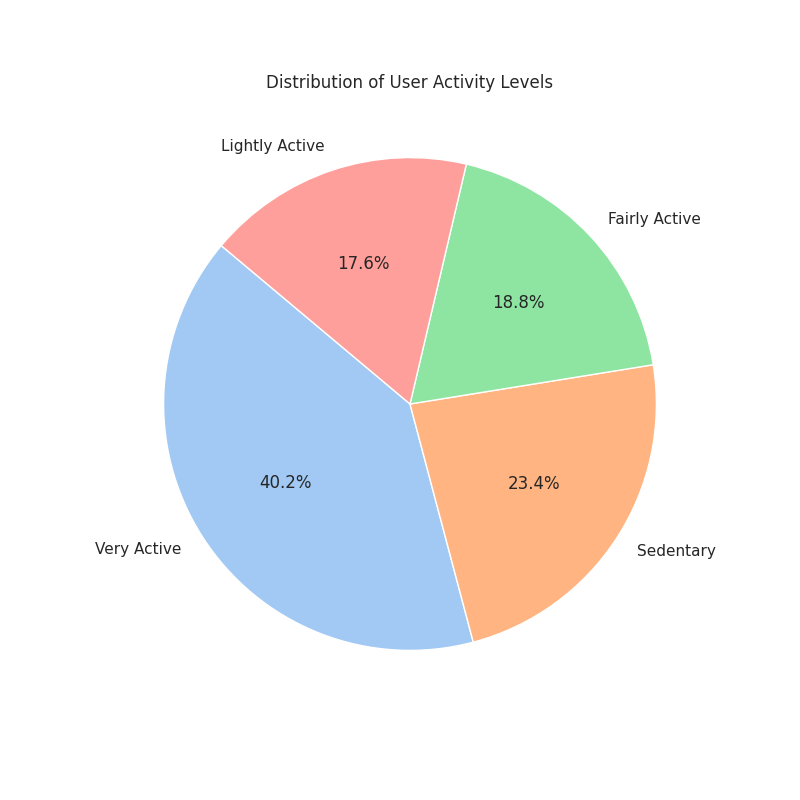
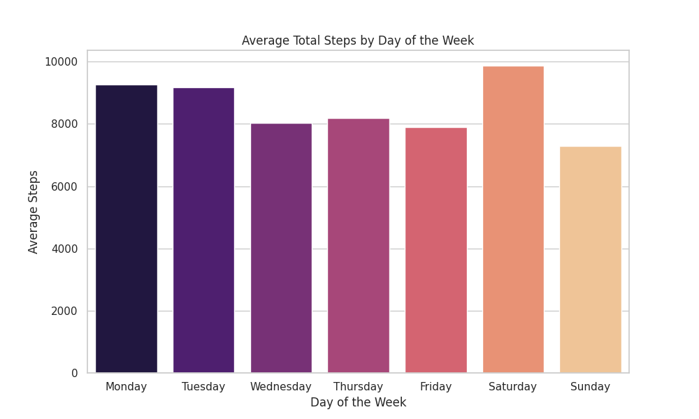

# Bellabeat Fitness Tracker Data Analysis

## Project Overview
This project involves a data analysis case study for Bellabeat, a high-tech manufacturer of health-focused products for women. As a junior data analyst on the marketing analytics team, the goal is to analyze smart device usage data from non-Bellabeat users to gain insights into consumer habits. These insights will then inform high-level recommendations for Bellabeat's marketing strategy.

## Business Task
Analyze smart device usage data to identify trends in how consumers use their devices, and apply these insights to a Bellabeat product to inform marketing strategy. The key questions addressed are:
1. What are some trends in smart device usage?
2. How could these trends apply to Bellabeat customers?
3. How could these trends help influence Bellabeat marketing strategy?

## Data Sources
The primary dataset used for this analysis is the **FitBit Fitness Tracker Data** [1], made available through Mobius on Kaggle. This dataset contains personal fitness tracker data from thirty eligible Fitbit users, collected between March 12, 2016, and May 12, 2016. It includes minute-level output for physical activity, heart rate, and sleep monitoring.

**Files Used:**
- `dailyActivity_merged.csv`: Contains daily activity summaries including steps, calories, and active minutes.
- `sleepDay_merged.csv`: Contains daily sleep records including total minutes asleep and total time in bed.

## Data Processing and Cleaning
The data processing and cleaning steps were performed using Python with the Pandas library. The main steps included:
- Loading `dailyActivity_merged.csv` and `sleepDay_merged.csv` into Pandas DataFrames.
- Converting date columns (`ActivityDate` and `SleepDay`) to datetime objects for proper manipulation.
- Identifying and removing duplicate entries in the `sleepDay` dataset.
- Merging the `dailyActivity` and `sleepDay` datasets on `Id` and `Date` to create a comprehensive dataset for analysis.
- Feature engineering: Calculating `TotalActiveMinutes` and categorizing users into `UserType` (Sedentary, Lightly Active, Fairly Active, Very Active) based on their `TotalSteps`.

## Key Findings and Visualizations

### 1. Relationship between Total Steps and Calories Burned
This scatter plot illustrates the correlation between the total steps taken by users and the calories they burned. It also categorizes users by their activity level, showing how different activity groups perform.



**Insight:** There is a positive correlation between total steps and calories burned. Users categorized as 'Very Active' tend to take more steps and burn significantly more calories. This suggests that encouraging higher step counts can directly lead to increased calorie expenditure.

### 2. Total Time in Bed vs Total Minutes Asleep
This regression plot visualizes the relationship between the total time users spend in bed and the actual minutes they spend asleep.



**Insight:** There is a strong positive linear relationship between time in bed and minutes asleep, indicating that more time spent in bed generally leads to more sleep. However, some outliers suggest inefficiencies in sleep for certain users, where time in bed does not directly translate to more sleep. This could be an area for Bellabeat to provide insights on sleep hygiene.

### 3. Distribution of User Activity Levels
This pie chart shows the distribution of users across different activity levels based on their daily step counts.



**Insight:** A significant portion of users fall into the 'Very Active' category (40.2%), followed by 'Sedentary' (23.4%) and 'Fairly Active' (18.8%). 'Lightly Active' users make up 17.6%. This distribution highlights diverse user needs, from highly active individuals to those with more sedentary lifestyles.

### 4. Average Total Steps by Day of the Week
This bar chart displays the average total steps taken by users on each day of the week.



**Insight:** Activity levels tend to be higher on weekends (Saturday and Sunday) compared to weekdays, with Saturday showing the highest average steps. This suggests that users might have more time for physical activity during their days off.

## Summary Statistics

```csv
count,mean,std,min,25%,50%,75%,max
Id,937,1.586930e+09,7.224150e+08,2.022484e+09,2.320153e+09,4.702922e+09,6.962181e+09,8.877689e+09
TotalSteps,937,7.637172e+03,5.087629e+03,0.000000e+00,3.793000e+03,7.405000e+03,1.077800e+04,3.601900e+04
TotalDistance,937,5.489706e+00,5.266147e+00,0.000000e+00,2.620000e+00,5.240000e+00,7.710000e+00,2.803000e+01
TrackerDistance,937,5.489706e+00,5.266147e+00,0.000000e+00,2.620000e+00,5.240000e+00,7.710000e+00,2.803000e+01
LoggedActivitiesDistance,937,1.081729e-01,6.194297e-01,0.000000e+00,0.000000e+00,0.000000e+00,0.000000e+00,4.942142e+00
VeryActiveDistance,937,1.502682e+00,2.658999e+00,0.000000e+00,0.000000e+00,0.210000e+00,2.660000e+00,2.192000e+01
ModeratelyActiveDistance,937,5.675454e-01,1.524603e+00,0.000000e+00,0.000000e+00,0.000000e+00,0.680000e+00,6.480000e+00
LightActiveDistance,937,3.340817e+00,2.041530e+00,0.000000e+00,1.940000e+00,3.360000e+00,4.780000e+00,1.071000e+01
SedentaryActiveDistance,937,1.000000e-04,4.472136e-04,0.000000e+00,0.000000e+00,0.000000e+00,0.000000e+00,1.000000e-02
VeryActiveMinutes,937,2.116435e+01,3.284340e+01,0.000000e+00,0.000000e+00,4.000000e+00,3.200000e+01,2.100000e+02
FairlyActiveMinutes,937,1.356457e+01,1.998607e+01,0.000000e+00,0.000000e+00,6.000000e+00,1.900000e+01,1.430000e+02
LightlyActiveMinutes,937,1.928122e+02,1.091747e+02,0.000000e+00,1.270000e+02,1.990000e+02,2.640000e+02,5.180000e+02
SedentaryMinutes,937,9.912102e+02,1.935842e+02,0.000000e+00,8.790000e+02,1.057000e+03,1.138000e+03,1.440000e+03
Calories,937,2.303609e+03,7.181668e+02,0.000000e+00,1.828000e+03,2.204000e+03,2.793000e+03,4.900000e+03
TotalSleepRecords,413,1.000000e+00,0.000000e+00,1.000000e+00,1.000000e+00,1.000000e+00,1.000000e+00,3.000000e+00
TotalMinutesAsleep,413,4.194673e+02,1.183446e+02,5.800000e+01,3.610000e+02,4.330000e+02,4.900000e+02,7.960000e+02
TotalTimeInBed,413,4.586392e+02,1.273329e+02,6.100000e+01,4.030000e+02,4.630000e+02,5.260000e+02,9.610000e+02
TotalActiveMinutes,937,2.275411e+02,1.408587e+02,0.000000e+00,1.460000e+02,2.290000e+02,3.170000e+02,5.180000e+02
```

## Recommendations for Bellabeat Marketing Strategy
Based on the analysis of the FitBit fitness tracker data, here are high-level recommendations for Bellabeat's marketing strategy:

1.  **Target 
1.  **Target Sedentary Users with Engagement Campaigns:** A significant portion of users are categorized as 'Sedentary'. Bellabeat can develop targeted marketing campaigns and in-app challenges to encourage these users to increase their daily activity. Highlighting the health benefits of even light activity and offering achievable goals could be effective. For example, promoting the Leaf or Time devices with features that gently nudge users towards more movement throughout the day.

2.  **Promote Sleep Hygiene Features:** The strong correlation between time in bed and minutes asleep, along with some outliers, indicates an opportunity to promote Bellabeat's sleep tracking features. Marketing could focus on how Bellabeat products (Leaf, Time) provide insights into sleep patterns and offer personalized guidance (via Bellabeat app/membership) to improve sleep quality, not just quantity. This could include tips for optimizing bedtime routines or stress reduction techniques.

3.  **Leverage Weekend Activity Trends:** Users are most active on weekends. Bellabeat can capitalize on this by launching weekend-specific challenges, promotions, or content (e.g., weekend workout plans, outdoor activity suggestions) through their app and social media channels. This aligns with existing user behavior and can reinforce brand engagement during peak activity times.

4.  **Highlight Calorie Burn and Step Tracking:** The clear relationship between steps and calories burned can be a powerful marketing message. Bellabeat can emphasize how their devices accurately track steps and calories, helping users achieve fitness goals. This could be particularly appealing to users focused on weight management or general fitness.

5.  **Personalized Guidance through Membership:** Given the diverse activity levels, Bellabeat's subscription-based membership program can be marketed as a solution for personalized guidance. This allows Bellabeat to cater to individual needs, from sedentary users needing motivation to very active users seeking advanced performance insights, thereby maximizing the value proposition of their products.

## Conclusion
By understanding these user behaviors and tailoring marketing strategies, Bellabeat can effectively attract and retain customers, ultimately strengthening its position in the wellness technology market.

## References
[1] FitBit Fitness Tracker Data. Kaggle. [https://www.kaggle.com/datasets/arashnic/fitbit](https://www.kaggle.com/datasets/arashnic/fitbit)
