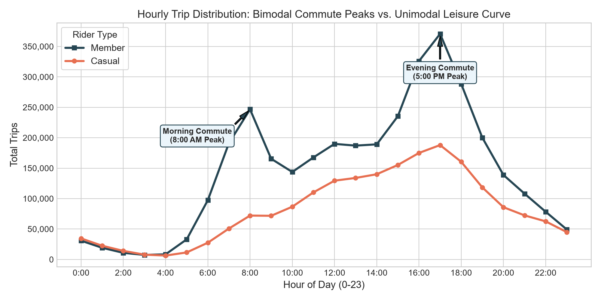
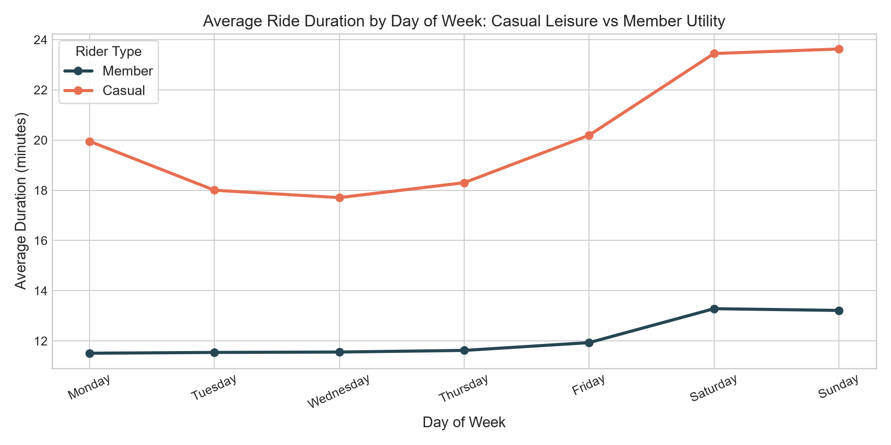
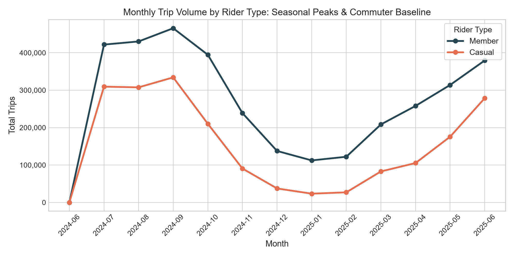
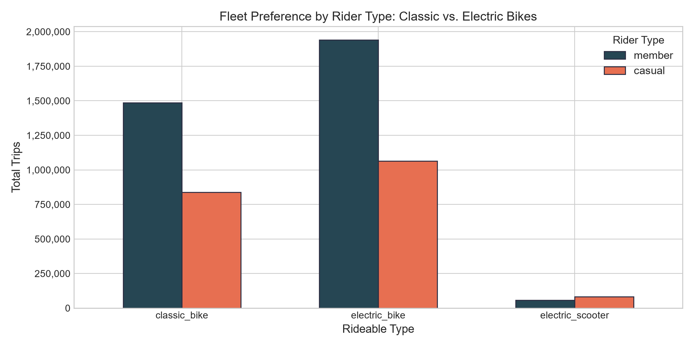

# Cyclistic Bike-Share: Converting Casual Riders to Annual Members


## Executive Summary

**Core Business Problem:** How do casual riders and annual members use Cyclistic bikes differently, and how can the marketing team design targeted, data-backed conversion campaigns to turn casual riders into profitable annual members?

This project is an end-to-end data analytics case study analyzing **5.47 million cleaned public trips** from the Divvy bicycle-sharing system in Chicago (the real-world data source behind the Google Data Analytics Cyclistic case study) across a rolling 12-month window (July 2024 – June 2025). 

Rather than relying on naive memory-heavy data frames, the analysis implements a **production-grade chunked streaming pipeline** in Python that validates data quality, handles row-level exclusions, aggregates key behavioral metrics, and outputs executive-ready visualizations and auditable summary reports.

---

## Key Strategic Findings & Visualizations

### 1. Diurnal Travel Patterns: Commuter Rush vs. Leisure Curve
The 24-hour diurnal distribution provides definitive behavioral evidence distinguishing member utility from casual recreation.



- **The Member Commute Signature:** Annual member ride volume exhibits pronounced bimodal peaks at **8:00 AM (246,681 trips)** and **5:00 PM (352,000+ trips)** on weekdays, mirroring standard corporate commute hours.
- **The Casual Afternoon Curve:** Casual trips follow a smooth unimodal curve peaking late in the afternoon (3:00 PM – 6:00 PM), characteristic of tourist, student, and leisure travel.

---

### 2. Duration Disparity: Utility Efficiency vs. Extended Leisure
Across the entire 12-month period, trip duration reveals stark differences in usage intent.



- **1.7x Duration Multiple:** Casual rides average **20.6 minutes**, compared to **12.0 minutes** for annual members.
- **Weekend Spikes:** Casual trip duration expands significantly on Saturdays (23.1 mins) and Sundays (24.2 mins), whereas member trip duration remains remarkably consistent (11.5–13.2 mins) throughout the entire week.

---

### 3. Seasonality & Volume Resilience
Trip volume across the 12-month window reflects Chicago's seasonal climate and highlights customer resilience.



- **Summer Peak:** Both groups peak between June and August (reaching ~450k monthly member rides and ~330k casual rides).
- **Winter Commuter Floor:** Casual ridership drops by over **85%** during freezing winter months (December–February), whereas member ridership retains a robust commuting baseline (~120k trips/month even in sub-zero conditions).

---

### 4. Fleet & Rideable Type Preferences
Adoption patterns across Classic, Electric, and Docked bikes indicate functional flexibility.



- **Electric Bike Dominance:** Electric bikes represent the preferred vehicle for both segments, offering faster point-to-point transit across Chicago's street network.
- **Docked Bike Anomaly:** Only casual riders utilize legacy "docked" bikes for prolonged rentals, which frequently trigger high overage fees.

---

## Executive Summary Statistics Table

Derived from the validated 12-month dataset ($N = 5,465,569$ cleaned trips):

| Rider Type | Total Cleaned Trips | Fleet Share | Average Ride Duration | Weekend Trip Share | Morning Peak Hour | Evening Peak Hour |
|:---|---:|---:|---:|---:|:---:|:---:|
| **Casual Rider** | 1,982,411 | 36.3% | 20.6 minutes | 37.0% | 11:00 AM | 5:00 PM |
| **Annual Member**| 3,483,158 | 63.7% | 12.0 minutes | 23.8% | 8:00 AM | 5:00 PM |

*Data Quality Note: 131,461 rows (2.35% of raw logs) were excluded under documented data quality rules (durations < 1 min or > 24 hrs, inverted timestamps, or missing station coordinates).*

---

## Actionable Recommendations & Growth Experiments

### 1. The "Commuter Bridge" Conversion Trial (Target: Weekday Casuals)
- **Insight:** Over 63% of casual rides occur on weekdays, with noticeable bumps during morning and evening rush hours.
- **Campaign:** Target casual riders who take 3+ weekday trips between 7:00–9:00 AM or 4:30–6:30 PM with a **"Commuter Trial Pass"** (14 days of free member-rate 45-minute rides). Convert them with an annual membership discount before the trial expires.

### 2. In-App Value Comparison Trigger (Target: High-Duration Casuals)
- **Insight:** Casual riders frequently pay single-ride unlock fees plus per-minute overages on trips exceeding 20 minutes.
- **Product Feature:** Immediately upon trip completion, trigger an in-app comparison receipt:
  > *"You just spent $6.50 on this 25-minute ride. With an Annual Membership ($11.99/mo), this ride and all your daily commutes are 100% free."*

### 3. Summer-to-Autumn "Season Pass" Transition
- **Insight:** Casual riders surge during June–August but churn in September.
- **Campaign:** In late August, offer summer pass holders the ability to roll 100% of their summer spend toward an Annual Membership, locking in year-round recurring revenue.

### 4. Controlled Experimentation Framework
- Test each campaign with a **randomized 10% holdout group**.
- Measure success across **primary metrics** (30-day conversion rate, CAC) and **guardrail metrics** (90-day retention, net contribution margin per rider).

---

## Repository Architecture

```text
cyclistic-divvy-bike-share-analysis/
├── data/
│   ├── source_urls.csv          # Manifest of 12 live AWS S3 archive URLs
│   ├── raw/                     # Downloaded monthly archives (gitignored)
│   └── processed/               # Precomputed summary tables (committed for audit)
│       ├── data_quality_report.csv
│       ├── day_member_summary.csv
│       ├── hour_member_summary.csv
│       ├── monthly_member_summary.csv
│       └── rideable_member_summary.csv
├── notebooks/
│   └── cyclistic_analysis.ipynb # Interactive executive walkthrough notebook
├── reports/
│   ├── analysis_summary.md      # Auto-generated markdown narrative
│   └── figures/                 # High-resolution PNG figures (embedded in README)
│       ├── average_duration_by_day.png
│       ├── bike_type_mix.png
│       ├── hourly_ride_distribution.png
│       └── monthly_ride_volume.png
├── scripts/
│   └── run_analysis.py          # Chunked streaming data pipeline
├── .gitignore
├── requirements.txt
└── README.md
```

---

## Reproduce the Analysis

### 1. Environment Setup

```bash
# Create virtual environment
python -m venv .venv

# Windows PowerShell
.venv\Scripts\Activate.ps1
# macOS / Linux
source .venv/bin/activate

# Install dependencies
pip install -r requirements.txt
```

### 2. Run Pipeline Options

```bash
# Option A: Instant Chart & Summary Regeneration (Uses committed processed summaries - no large downloads needed)
python scripts/run_analysis.py --charts-only

# Option B: Run pipeline on the first 2 months of raw archive data
python scripts/run_analysis.py --months 2

# Option C: Full End-to-End Pipeline (Downloads all 12 monthly archives from AWS S3)
python scripts/run_analysis.py
```

---

## Data Cleaning & Validation Rules

Row-level exclusions are tracked deterministically in `data/processed/data_quality_report.csv`:
- **Timestamp Integrity:** Requires `ended_at > started_at`; strips unparseable datetime strings.
- **Duration Boundary:** Drops trips $< 1$ minute (potential false docks/aborted rides) and $> 24$ hours (lost/stolen bikes).
- **Membership Categorization:** Restricts analysis strictly to confirmed `member` and `casual` classifications.
- **Memory Optimization:** Processes records in 200,000-row chunks to ensure memory efficiency on standard laptop environments.

---

## Author & Contact

**Musaddiq** — *Data Analyst*  
*Specializing in Product Analytics, Business Intelligence, and Python Pipelines.*
